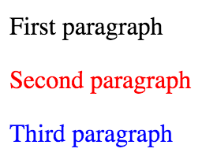
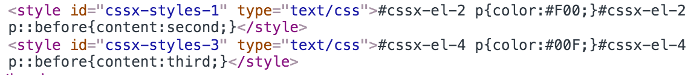

# Using vanilla CSS in React application

Yet another way to apply CSS styles in JavaScript. It's not using an inline styling though. It's injecting a `<style>` tag.

```jsx
import React from 'react';
import CSSX from 'react-cssx';

class Component extends React.Component {
  render() {
    return (
      <CSSX styles={ this.css() }>
        <h1>Title styled with <i>CSSX</i></h1>
      </CSSX>
    );
  }
  css() {
    var color = '#BADA55';

    return (
      <style>
        h1 {
          color: {{ color }};
        }
        h1 i {
          text-decoration: underline;
        }
      </style>
    );
  }
}
```

To make the code above works you'll need:

* CSSX component (`npm install react-cssx`)
* CSSX transpiler (It's available [here](https://github.com/krasimir/cssx/tree/master/packages/cssx-transpiler). Get it as a [webpack loader](https://github.com/krasimir/cssx/blob/master/packages/cssx-loader) or [gulp plugin](https://github.com/krasimir/cssx/blob/master/packages/gulp-cssx).)

Demo [here](http://krasimir.github.io/react-cssx/example/1/) and [here](http://krasimir.github.io/react-cssx/example/2/).

### CSSX component

`<CSSX>` component requires only one attribute - `styles`. It should be an array in the following format:

```js
[
  ['h1', { 'font-size': '32px' }],
  ['h1 small', { 'font-size': '24px', 'font-weight': 'bold' }]
]
```

Of course writing CSS that way is not really nice. So let's use CSSX and replace it with:

```js
css() {
  return (
    <style>
      h1 {
        font-size: 32px;
      }
      h1 small {
        font-size: 24px;
        font-weight: bold;
      }
    </style>
  );
}
```

*Notice that we should use a function that returns a `<style>` tag. If we create the `<style>` tag directly (in the render method for example) we'll get the CSS applied straight away to the whole page.*

### Scoping

If you check [some](http://krasimir.github.io/react-cssx/example/2/) of the [examples](https://github.com/krasimir/react-cssx/tree/master/example) in a browser you'll see that the created styles are scoped to a specific element. For example:

```jsx
class Component extends React.Component {
  render() {
    return (
      <section>
        <p>First paragraph</p>
        <CSSX styles={ this.styleParagraph('#F00', 'second') }>
          <p>Second paragraph</p>
        </CSSX>
        <CSSX styles={ this.styleParagraph('#00F', 'third') }>
          <p>Third paragraph</p>
        </CSSX>
      </section>
    );
  }
  styleParagraph(color, text) {
    return (
      <style>
        p {
          color: {{ color }};
        }
        p::before { 
          content: {{ text }};
        }
      </style>
    );
  }
}
```

There are three paragraphs rendered on the screen:



The first one does not have any local styles attached. However, the second and the third one are styled differently. They have their own dedicated CSS. [CSSX library](https://github.com/krasimir/cssx/tree/master/packages/cssx) creates two `<style>` tags in the `<head>` of the document.



### Misc

If this sounds interesting to you follow the links below:

* [CSSX](https://github.com/krasimir/cssx/)
* [CSSX *language*](https://github.com/krasimir/cssx/blob/master/docs/cssx-lang.md)
* [CSSX client-side library](https://github.com/krasimir/cssx/tree/master/packages/cssx)
* [CSSX transpiler](https://github.com/krasimir/cssx/tree/master/packages/cssx-transpiler)


